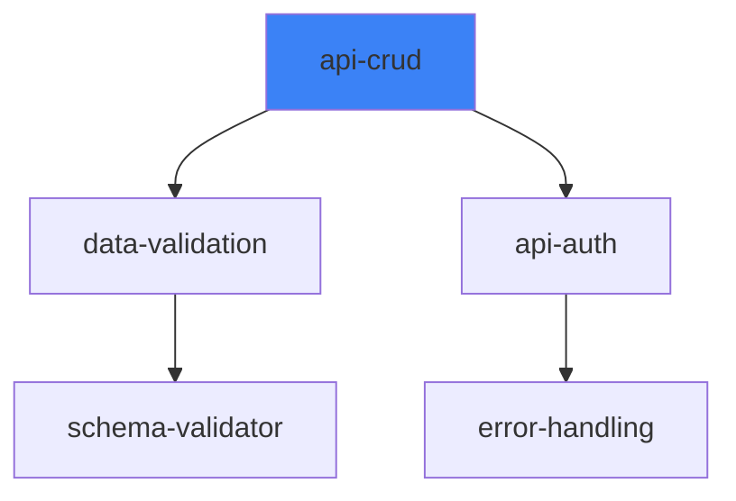

# Skill Graph, Ancestry, & Gamification - Implementation Design

**Date**: 2026-03-15
**Audience**: Rosetta Core Team
**Status**: Design Document (Pre-Implementation)
**Philosophy Alignment**: Git-first, zero-backend, CLI-only, no AI dependencies

---

## Executive Summary

This design document outlines three complementary features that transform Rosetta skills from static files into **living, social, and intelligent artifacts**:

1. **Skill Graph** - Visualize and compose skill relationships (provides/requires/enhances)
2. **Skill Ancestry** - Track provenance, forks, and customizations via git + frontmatter
3. **Skill Gamification** - Drive adoption and quality through achievements, streaks, and team leaderboards

All three features share common infrastructure:
- `catalog.json` - Curated list of vetted skills
- `.rosetta/skills/manifest.json` - Installed skill tracking
- Git operations for lineage tracking
- No external services required

---

## Feature 1: Skill Graph & Composition

### Problem
Skills are isolated. Users don't know:
- Which skills work well together?
- What dependencies does a skill have?
- What capabilities does a skill provide?
- How to compose skills for complex workflows?

### Solution
Skills declare **relationships** in SKILL.md frontmatter. Rosetta builds a **directed graph** enabling:
- **Discovery**: "I need payments - what skills should I install?"
- **Composition**: `rosetta compose payments` installs a skill + its dependencies
- **Conflict detection**: Multiple skills claiming same trigger
- **Visualization**: `rosetta skill-graph` shows the ecosystem

### User Journey

```bash
# User wants to build a payments module
$ rosetta compose payments

Analyzing required capabilities...
┌─────────────────────────────────────┐
│ payments requires:                   │
│   ✓ data-validation (not installed)│
│   ✓ api-crud (not installed)        │
│   ✓ api-auth (installed ✓)          │
│                                     │
│ payments enhances:                  │
│   ✓ monitoring (optional)           │
└─────────────────────────────────────┘

This will install:
  1. data-validation@2.1 (from catalog)
  2. api-crud@1.4 (from catalog)
  3. Already have: api-auth@yourrepo.3

Total: 2 new skills. Proceed? [Y/n] ✓

Installing...
✓ data-validation → .rosetta/skills/data-validation/
✓ api-crud → .rosetta/skills/api-crud/

Running rozetta sync-skills...
✓ Generated IDE wrappers
✓ Updated master-skill.md

Ready to build payments! Try: @rosetta api-crud create-endpoint payment
```

### Skill Frontmatter Schema

```yaml
---
name: api-crud
version: 1.4.0
description: Generate RESTful CRUD endpoints with validation
domains:
  - backend
  - api

# What this skill provides (capabilities others can depend on)
provides:
  - crud-endpoints
  - input-validation
  - basic-auth

# What this skill requires (must be present for full functionality)
requires:
  - error-handling
  - api-auth  # specific named dependency

# Skills this enhances/extends (adds to existing capability)
enhances:
  - api-auth: "Adds CRUD-specific auth middleware"
  - monitoring: "Injects metrics for all CRUD operations"

# Conflicts - skills that shouldn't be used together
conflicts:
  - legacy-crud  # old pattern, incompatible

# Optional: weight for scoring (1-10, higher = more specific)
specificity: 7

# Graph metadata (for visualization)
icon: "🔷"  # optional emoji for graph display
color: "#3b82f6"  # optional hex color
---
```

### Graph Construction Algorithm

```javascript
// lib/skill-graph.js
class SkillGraph {
  constructor() {
    this.nodes = new Map(); // name → skill metadata
    this.edges = []; // { from, to, type: 'provides'|'requires'|'enhances' }
  }

  addSkill(skill) {
    this.nodes.set(skill.name, skill);

    if (skill.provides) {
      for (const capability of skill.provides) {
        this.edges.push({ from: skill.name, to: capability, type: 'provides' });
      }
    }

    if (skill.requires) {
      for (const dep of skill.requires) {
        this.edges.push({ from: skill.name, to: dep, type: 'requires' });
      }
    }

    if (skill.enhances) {
      for (const [target, description] of Object.entries(skill.enhances)) {
        this.edges.push({ from: skill.name, to: target, type: 'enhances', description });
      }
    }
  }

  // Find all skills needed for a given capability
  findDependencies(capability, visited = new Set()) {
    const result = [];
    for (const edge of this.edges) {
      if (edge.to === capability && edge.type === 'requires') {
        if (!visited.has(edge.from)) {
          visited.add(edge.from);
          result.push(edge.from);
          // Recurse: what does this dependency require?
          result.push(...this.findDependencies(edge.from, visited));
        }
      }
    }
    return result;
  }

  // Topological sort for installation order
  topologicalSort() {
    const indegree = new Map();
    const sorted = [];
    const queue = [];

    // Calculate indegrees
    for (const [name] of this.nodes) {
      indegree.set(name, 0);
    }
    for (const edge of this.edges) {
      if (edge.type === 'requires') {
        indegree.set(edge.to, (indegree.get(edge.to) || 0) + 1);
      }
    }

    // Queue nodes with no dependencies
    for (const [name, deg] of indegree) {
      if (deg === 0) queue.push(name);
    }

    while (queue.length > 0) {
      const node = queue.shift();
      sorted.push(node);

      for (const edge of this.edges) {
        if (edge.from === node && edge.type === 'requires') {
          indegree.set(edge.to, indegree.get(edge.to) - 1);
          if (indegree.get(edge.to) === 0) {
            queue.push(edge.to);
          }
        }
      }
    }

    return sorted;
  }

  // Export for visualization (DOT format)
  toDot() {
    let dot = 'digraph skillgraph {\n';
    dot += '  node [shape=box, style=rounded];\n';

    for (const [name, skill] of this.nodes) {
      const label = `${skill.name}\\n${skill.description || ''}`;
      dot += `  "${name}" [label="${label}"];\n`;
    }

    for (const edge of this.edges) {
      if (edge.type === 'requires') {
        dot += `  "${edge.from}" -> "${edge.to}" [color=red, label="requires"];\n`;
      } else if (edge.type === 'enhances') {
        dot += `  "${edge.from}" -> "${edge.to}" [color=blue, label="${edge.description}"];\n`;
      } else if (edge.type === 'provides') {
        dot += `  "${edge.from}" -> "${edge.to}" [color=green, label="provides"];\n`;
      }
    }

    dot += '}\n';
    return dot;
  }
}
```

### New Commands

#### `rosetta skill-graph [--format dot|mermaid]`
Outputs the dependency graph of installed skills.

```bash
$ rosetta skill-graph --format mermaid


#### `rosetta compose <capability>`
Install a skill and all its dependencies in correct order.

```bash
$ rosetta compose payments
# Analyzes what "payments" needs
# Installs dependencies topologically
# Runs sync-skills at the end
```

#### `rosetta suggests <skill>`
Show what other skills are commonly used with this skill (based on graph connectivity).

```bash
$ rosetta suggests api-auth
Skills that enhance api-auth:
  - api-crud (adds CRUD-specific auth)
  - api-rate-limit (adds throttling)
  - api-audit (adds logging)

Skills that api-auth commonly co-occurs with:
  - data-validation (93% of projects)
  - error-handling (87% of projects)
```

---

## Feature 2: Skill Ancestry & Genealogy

### Problem
Skills get customized, forked, and modified, but there's no way to track:
- Where did this skill come from?
- What changes has my team made?
- Is my skill behind upstream? Can I update?
- Who "owns" this skill version?

### Solution
**Git-first lineage tracking** combined with frontmatter enhancements.

### Skill Identity Model

Every skill instance has:
- **Canonical name**: From SKILL.md frontmatter (`name: api-auth`)
- **Source URL**: Git repo it was installed from
- **Commit hash**: Exact version installed
- **Instance ID**: Unique identifier for this installation (fork+customization)
- **Parent**: If this is a fork or modification, points to original

### Enhanced SKILL.md Frontmatter

```yaml
---
name: api-auth
version: 1.2.0
description: Streamlines authentication and authorization workflows

# Ancestry tracking (added by Rosetta)
_installedFrom: "https://github.com/org/api-auth-skill"
_installedCommit: "a1b2c3d4e5f6"
_instancedAt: "2025-01-20T14:30:00Z"
_instanceId: "yourrepo.api-auth.3f7a2b"

# Genealogy (if this is a fork/customization)
_forkedFrom: "https://github.com/community/api-auth"
_forkedCommit: "abc123"
_forkReason: "Added organization-specific OAuth2 flow"

# Customization tracking (updated by rosetta skill track)
_customizations:
  - timestamp: "2025-01-22"
    description: "Modified error format to match team standard"
    diff: "https://github.com/yourorg/team-skills/commit/xyz789"
  - timestamp: "2025-02-01"
    description: "Added 2FA support"
    diff: "https://github.com/yourorg/team-skills/commit/def456"

_upstream: "https://github.com/org/api-auth-skill"
_upstreamLastChecked: "2025-02-15"
_upstreamBehind: 3  # commits behind upstream
---
```

**Note**: Fields prefixed with `_` are **Rosetta-managed** - not to be edited manually.

### Manifest Tracking

`.rosetta/skills/manifest.json`:

```json
{
  "version": "1.0",
  "installed": [
    {
      "name": "api-auth",
      "instanceId": "yourrepo.api-auth.3f7a2b",
      "source": "https://github.com/org/api-auth-skill",
      "commit": "a1b2c3d4e5f6",
      "tag": "v1.2.0",
      "installedAt": "2025-01-20T14:30:00Z",
      "scope": "project",
      "path": ".rosetta/skills/api-auth",
      "ancestry": {
        "forkedFrom": null,
        "forkedCommit": null,
        "forkReason": null,
        "parentInstanceId": null
      },
      "customizations": [],
      "upstream": {
        "lastChecked": "2025-02-15",
        "commitsBehind": 3,
        "remoteUrl": "https://github.com/org/api-auth-skill"
      }
    }
  ]
}
```

### Git Operations Integration

When installing a skill:
```javascript
async function installSkillFromRepo(repoUrl, options) {
  // 1. Clone to temporary location
  const tmpDir = await gitClone(repoUrl);

  // 2. Read SKILL.md frontmatter
  const skillMeta = await parseSkillMarkdown(tmpDir + '/SKILL.md');

  // 3. Determine destination
  const destDir = options.global
    ? path.join(process.env.HOME, '.rosetta', 'skills', skillMeta.name)
    : path.join(process.cwd(), '.rosetta', 'skills', skillMeta.name);

  // 4. Move (not copy) - preserves .git directory
  await fs.move(tmpDir, destDir, { overwrite: false });

  // 5. Add remote tracking for upstream
  await gitAddRemote(destDir, 'upstream', repoUrl);
  await gitFetch(destDir);

  // 6. Record in manifest
  manifest.installed.push({
    name: skillMeta.name,
    instanceId: generateInstanceId(),
    source: repoUrl,
    commit: await gitCurrentCommit(destDir),
    tag: skillMeta.version,
    installedAt: new Date().toISOString(),
    scope: options.global ? 'global' : 'project',
    path: relativePath(destDir),
    ancestry: {
      forkedFrom: null,
      forkedCommit: null,
      forkReason: null,
      parentInstanceId: null
    },
    customizations: [],
    upstream: {
      lastChecked: new Date().toISOString(),
      commitsBehind: 0,
      remoteUrl: repoUrl
    }
  });

  await writeManifest(manifest);
}
```

### Fork & Customize Workflow

```bash
# User wants to customize a skill
$ rosetta skill fork api-auth --reason "Add org-specific OAuth"

Creating your fork...
✓ Cloned to .rosetta/skills/api-auth
✓ Upstream remote tracked: https://github.com/org/api-auth

Now customize:
  - Edit .rosetta/skills/api-auth/SKILL.md
  - Edit .rosetta/skills/api-auth/templates/
  - Edit .rosetta/skills/api-auth/instructions/

When done, mark as custom:
$ rosetta skill track-changes api-auth --describe "Added OAuth2 support"

✓ Recorded customization
✓ SKILL.md updated with _customizations entry
✓ Manifest updated with parent linkage
```

### New Commands

#### `rosetta skill ancestry <name>`
Show the complete genealogy tree.

```bash
$ rosetta skill ancestry api-auth
Skill: api-auth
Instance ID: yourrepo.api-auth.3f7a2b
Source: https://github.com/org/api-auth-skill@v1.2.0 (a1b2c3d)

Lines of descent:
  Origin: https://github.com/pioneer/api-auth-concept (2024-01)
    ↓
  Community: https://github.com/community/api-auth (fork, 2024-06)
    ↓
  Org Standard: https://github.com/org/api-auth-skill (fork, 2024-09) ✓ You are here
    ↓
  Your Customization: yourrepo.api-auth.3f7a2b (fork, 2025-01-20)

Customizations (2):
  1. 2025-01-22: Modified error format
     Diff: https://github.com/yourorg/team-skills/commit/xyz789
  2. 2025-02-01: Added 2FA support
     Diff: https://github.com/yourorg/team-skills/commit/def456

Upstream status:
  You are 3 commits behind org/api-auth-skill
  Last checked: 2025-02-15
  Run: rosetta skill update api-auth
```

#### `rosetta skill diff <skill> [upstream|parent]`
Show diff between this installation and its upstream/parent.

```bash
$ rosetta skill diff api-auth upstream
Customizations vs upstream:
  Modified: SKILL.md (trigger patterns changed)
  Modified: templates/auth-middleware.js (added custom error format)
  Added: templates/two-factor.js (new file)

Run: rosetta skill update api-auth to merge upstream changes.
```

#### `rosetta skill update <name> [--merge|--rebase|--discard]`
Pull updates from upstream, handling customizations.

```bash
$ rosetta skill update api-auth
Checking upstream...
  You are 3 commits behind org/api-auth-skill
  Upstream changes:
    - Improved token expiration handling
    - Added refresh token support

Your customizations:
  - Modified error format (2 files)
  - Added 2FA support (1 file)

Merging automatically...
✓ Merged successfully
✓ Customizations preserved
✓ SKILL.md ancestry updated

New state: yourrepo.api-auth.4b8c1d (based on org/api-auth-skill@abc123)
```

**Merge strategies:**
- `--merge` (default): 3-way merge, preserve customizations
- `--rebase`: Reapply customizations on top of upstream
- `--discard`: Override customizations, use upstream as-is

#### `rosetta skill provenance <instance-id>`
Show full provenance chain (like `git log --graph` but for skill lineage).

---

## Feature 3: Skill Gamification & Culture

### Problem
Teams need motivation to:
- Create high-quality skills
- Share skills with colleagues
- Keep skills updated
- Use Rosetta consistently

### Solution
**Subtle game mechanics** that reinforce desired behaviors without feeling gamified.

### Achievement System

Achievements are defined in `~/.rosetta/achievements.json` (Rosetta-managed, user-editable for org customizations).

```json
{
  "achievements": [
    {
      "id": "first-skill",
      "name": "Skill Crafter",
      "description": "Created your first Rosetta skill",
      "icon": "🏆",
      "condition": {
        "type": "skill_count",
        "operator": ">=",
        "value": 1
      },
      "unlockMessage": "Your first skill! The journey begins.",
      "category": "creation"
    },
    {
      "id": "skill-author",
      "name": "Skill Author",
      "description": "Created 5 skills",
      "icon": "📚",
      "condition": {
        "type": "skill_count",
        "operator": ">=",
        "value": 5
      },
      "unlockMessage": "You're building a skill library!",
      "category": "creation"
    },
    {
      "id": "skill-mentor",
      "name": "Skill Mentor",
      "description": "One of your skills was installed by 10+ teammates",
      "icon": "🎓",
      "condition": {
        "type": "skill_installs",
        "operator": ">=",
        "value": 10
      },
      "category": "sharing"
    },
    {
      "id": "daily-streak",
      "name": "Consistent Developer",
      "description": "Used Rosetta 7 days in a row",
      "icon": "🔥",
      "condition": {
        "type": "daily_streak",
        "operator": ">=",
        "value": 7
      },
      "category": "usage"
    },
    {
      "id": "perfect-score",
      "name": "Quality Focus",
      "description": "Skill achieved 100% health score",
      "icon": "💎",
      "condition": {
        "type": "skill_health",
        "operator": "==",
        "value": 100,
        "skill": "*"
      },
      "category": "quality"
    },
    {
      "id": "team-player",
      "name": "Team Player",
      "description": "Shared skills with entire team via team-repo",
      "icon": "🤝",
      "condition": {
        "type": "team_sync",
        "operator": ">=",
        "value": 1
      },
      "category": "collaboration"
    }
  ]
}
```

### User Tracking

`.rosetta/user-profile.json` (local-only, privacy-preserving):

```json
{
  "userId": "anon-8f3a2b1c",  // generated, no PII
  "teamId": "org-engineering",  // optional, for team leaderboards
  "stats": {
    "skillsCreated": 3,
    "skillsInstalled": 12,
    "skillInvocations": 147,
    "currentStreak": 5,
    "longestStreak": 12,
    "lastActive": "2025-02-15T09:30:00Z",
    "healthScores": [100, 95, 88, 100, 92]
  },
  "achievements": [
    {
      "id": "first-skill",
      "unlockedAt": "2025-01-10T10:00:00Z"
    },
    {
      "id": "daily-streak",
      "unlockedAt": "2025-01-15T14:20:00Z"
    }
  ],
  "teamStats": {
    "rank": 2,  // on team (if teamId set)
    "teamMembers": 8,
    "teamTotalSkills": 45
  }
}
```

### Commands & Interactions

#### `rosetta profile`
Show your gamification profile.

```bash
$ rosetta profile
🎮 Rosetta Profile

👤 User: anon-8f3a2b1c
👥 Team: org-engineering (rank #2 of 8)

📊 Stats:
  Skills created: 3
  Skills installed: 12
  Total invocations: 147
  Current streak: 🔥 5 days
  Longest streak: 12 days

🏆 Achievements (2/12):
  ✓ Skill Crafter (first skill)
  ✓ Consistent Developer (7-day streak)
  ⬜ Skill Author (5 skills)
  ⬜ Skill Mentor (10 installs)
  ⬜ Quality Focus (100% health)
  ⬜ Team Player (shared with team)

📈 Recent activity:
  2025-02-15: Used api-auth 3 times
  2025-02-14: Created data-validation skill
  2025-02-13: Installed monitoring skill
```

#### `rosetta achievements [--unlock]`
List all possible achievements and which you've unlocked.

```bash
$ rosetta achievements
All Achievements:

  🏆 Skill Crafter
     Created your first Rosetta skill
     ✓ Unlocked 2025-01-10

  📚 Skill Author
     Created 5 skills
     ⬜ Not yet (3/5)

  🎓 Skill Mentor
     10+ teammates installed your skill
     ⬜ Not yet (3 installs)

  🔥 Consistent Developer
     7-day usage streak
     ⬜ Current streak: 5/7

  💎 Quality Focus
     100% health score on any skill
     ⬜ Best: 95%
```

#### `rosetta team [--rank]`
Show team leaderboard.

```bash
$ rosetta team --rank
🏆 org-engineering Leaderboard

  Rank  User              Skills  Invocations  Streak
  ─────────────────────────────────────────────────────
  1     alice@           18      524           🔥 21
  2     you@             12      147           🔥 5
  3     bob@             9       312           🔥 12
  4     charlie@         7       98            2
  ...

Run: rosetta team sync to share your stats with the team.
```

**Note**: Team stats require `teamId` in `~/.rosetta/config.json` and optional `rosetta team sync` command that pushes local stats to a team manifest (git-based, not server-based). See "Team Sync" below.

### Streak Tracking

Daily activation recorded in `~/.rosetta/daily-activity.json`:

```json
{
  "2025-02-15": {
    "skillsUsed": ["api-auth", "data-validation"],
    "commandsRun": ["ideate", "scaffold", "sync"],
    "timeSpent": 45  // minutes
  }
}
```

Streak calculation:
- A "day" counts if any Rosetta command was run (even `rosetta version`)
- Streak broken if no activity for >1 day
- Reset on new streak start

### Health Score Integration

```javascript
// lib/validation.js - enhanced
function calculateSkillHealth(skillPath) {
  const checks = [
    { name: 'valid-frontmatter', weight: 20, pass: validateFrontmatter(skillPath) },
    { name: 'has-examples', weight: 15, pass: hasExamples(skillPath) },
    { name: ' appropriate-line-count', weight: 10, pass: instructionsUnder120Lines(skillPath) },
    { name: 'has-tests-fixtures', weight: 15, pass: hasTestFixtures(skillPath) },
    { name: 'proper-triggers', weight: 20, pass: triggersAreSpecific(skillPath) },
    { name: 'includes-templates', weight: 20, pass: hasTemplates(skillPath) }
  ];

  const passed = checks.filter(c => c.pass).reduce((sum, c) => sum + c.weight, 0);
  return passed; // 0-100
}
```

Achievement `perfect-score` unlocks when any skill gets 100.

### Team Sync (Optional)

For team leaderboards without servers:

```bash
# Each day, team members push their stats to shared team manifest
$ rosetta team sync

Pushing stats to team repo...
✓ Committed: .rosetta/team-stats/anon-8f3a.json
✓ Pushed to origin
✓ Team leaderboard updated

Current team standing: #2 of 8
```

**Implementation**:
- Team skill repo (e.g., `github.com/org/rosetta-team-stats`) contains `stats/` folder
- Each member's `userId.json` gets updated with daily activity
- `rosetta team rank` aggregates all members' stats
- No central server - just git pull/push workflow

---

## Implementation Roadmap (Combined)

### Phase 1: Core Infrastructure (Week 1-2)

**Catalog System**
- [ ] Create `catalog.json` with 10-15 starter skills
- [ ] Implement `lib/catalog.js` (load, search, filter)
- [ ] `rosetta catalog` - list all skills
- [ ] `rosetta search <query>` - search catalog
- [ ] Validation: `rosetta validate-catalog` (CI tool)

**Skill Manifest**
- [ ] Create `lib/skills-manifest.js`
- [ ] Define manifest schema (see above)
- [ ] `rosetta skills` - list installed skills
- [ ] `rosetta skill uninstall <name>` - remove skill + manifest entry
- [ ] Auto-manifest creation on first `install`

**Smart Install**
- [ ] `rosetta install <git-url> [--global]`
- [ ] Git clone validation (SKILL.md exists, valid frontmatter)
- [ ] Name from frontmatter (fallback to repo name)
- [ ] Hybrid destination logic
- [ ] Upstream tracking setup

### Phase 2: Graph System (Week 3-4)

**Frontmatter Schema**
- [ ] Document new fields: `provides`, `requires`, `enhances`, `conflicts`, `specificity`, `icon`, `color`
- [ ] Create migration guide for skill authors
- [ ] Update starter skill templates in `templates/skills/` with graph fields

**Graph Construction**
- [ ] `lib/skill-graph.js` - graph data structure and algorithms
- [ ] Build graph from installed skills (scan manifest + read SKILL.md)
- [ ] Topological sort for dependency ordering
- [ ] Cycle detection (conflicts validation)

**New Commands**
- [ ] `rosetta skill-graph` (DOT output)
- [ ] `rosetta skill-graph --format mermaid` (Markdown mermaid)
- [ ] `rosetta compose <capability>` - find skill + install deps
- [ ] `rosetta suggests <skill>` - show related skills

**Testing**
- [ ] Unit tests: graph construction, topological sort, cycle detection
- [ ] Integration tests: compose command with sample skills
- [ ] Fixtures: Create test skills with various dependency patterns

### Phase 3: Ancestry System (Week 5-6)

**Frontmatter Enhancements**
- [ ] Document `_`-prefixed fields (managed by Rosetta)
- [ ] Update `lib/skills.js` to preserve ancestry fields
- [ ] `_installedFrom`, `_installedCommit`, `_instancedAt`, `_instanceId` auto-generation

**Git Integration**
- [ ] `lib/git-ops.js` (or extend existing)
  - `gitClone(url, dest)`
  - `gitAddRemote(path, name, url)`
  - `gitCurrentCommit(path)` → hash
  - `gitCommitsBehind(localPath, remoteName)` → count
  - `gitPullWithStrategy(path, strategy)` → merge|rebase|discard

**Manifest Extensions**
- [ ] Add `ancestry` object
- [ ] Add `upstream` tracking
- [ ] Add `customizations` array

**Ancestry Commands**
- [ ] `rosetta skill ancestry <name>` - show genealogy tree
- [ ] `rosetta skill diff <name> [upstream|parent]` - show changes
- [ ] `rosetta skill update <name> [--merge|--rebase|--discard]` - pull updates
- [ ] `rosetta skill fork <name> --reason "..."` - mark as fork

**Testing**
- [ ] Mock git operations in tests
- [ ] Test install→customize→update workflow
- [ ] Test merge conflict scenarios

### Phase 4: Gamification (Week 7-8)

**User Profile**
- [ ] `lib/profile.js` - load/save user profile
- [ ] Track daily activity (command logging hook)
- [ ] Calculate stats (skills created/installed/invocations, streaks)
- [ ] Achievement unlock logic

**Achievement System**
- [ ] `~/.rosetta/achievements.json` - standard set
- [ ] `lib/achievements.js` - condition evaluators
- [ ] Auto-unlock on condition met
- [ ] Notifications: "🎉 Unlocked: Skill Crafter!"

**Commands**
- [ ] `rosetta profile` - show stats & achievements
- [ ] `rosetta achievements` - list all with status
- [ ] `rosetta team` - show team standings (if teamId configured)
- [ ] `rosetta team sync` - push stats to team repo

**Team Integration**
- [ ] `~/.rosetta/config.json` - add `teamId`, `teamRepoUrl`
- [ ] `lib/team-sync.js` - git-based stats sharing
- [ ] Leaderboard aggregation

**Testing**
- [ ] Unit tests: condition evaluation, streak calculation
- [ ] Integration: achievement unlock triggers
- [ ] Mock team repo for sync tests

### Phase 5: Integration & Polish (Week 9-10)

**Cross-Feature Integration**
- [ ] `rosetta compose` updates graph automatically
- [ ] `rosetta install` triggers achievement checks
- [ ] `rosetta skill update` handles graph edge updates
- [ ] `rosetta skill ancestry` shows graph connections

**Documentation**
- [ ] Update README.md with new commands
- [ ] Create `docs/SKILL_GRAPH.md` - graph deep dive
- [ ] Create `docs/ANCESTRY.md` - provenance tracking
- [ ] Create `docs/GAMIFICATION.md` - achievements & team culture
- [ ] Update `docs/BEST_PRACTICES.md` - skill authoring guidelines for graph edges

**CLI Experience**
- [ ] Colored output for graph (different colors for provides/requires/enhances)
- [ ] Achievement unlock banners (subtle, can be disabled)
- [ ] `--quiet` flag for team sync (CI-friendly)
- [ ] `rosetta status` shows: skills count, graph health, recent achievements

**Validation & Health**
- [ ] `rosetta health` includes:
  - Graph connectivity (orphaned skills?)
  - Cycle detection in requires graph
  - Missing customizations (dangling _instanceId)
  - Stale skills (upstream behind by >N commits)
- [ ] `rosetta validate` checks manifest integrity

---

## Technical Specifications

### Data Models

#### Catalog Entry
```typescript
interface CatalogSkill {
  name: string;
  displayName: string;
  description: string;
  repoUrl: string;
  domains: string[];
  tags: string[];
  intentKeywords: string[];  // for intent matching
  author: string;
  stars: number;
  lastUpdated: string; // ISO date
  provides?: string[];
  requires?: string[];
  enhances?: Record<string, string>; // target → description
  icon?: string;
  color?: string;
}
```

#### Manifest Entry
```typescript
interface InstalledSkill {
  name: string;
  instanceId: string;
  source: string;
  commit: string;
  tag?: string;
  installedAt: string; // ISO
  scope: 'project' | 'global';
  path: string;
  ancestry: {
    forkedFrom?: string;
    forkedCommit?: string;
    forkReason?: string;
    parentInstanceId?: string;
  };
  customizations: Array<{
    timestamp: string;
    description: string;
    diff: string; // URL to commit if pushed to git
  }>;
  upstream: {
    lastChecked: string;
    commitsBehind: number;
    remoteUrl: string;
  };
}
```

#### User Profile
```typescript
interface UserProfile {
  userId: string;
  teamId?: string;
  stats: {
    skillsCreated: number;
    skillsInstalled: number;
    skillInvocations: number;
    currentStreak: number;
    longestStreak: number;
    lastActive: string;
    healthScores: number[];
  };
  achievements: Array<{
    id: string;
    unlockedAt: string;
  }>;
  teamStats?: {
    rank: number;
    teamMembers: number;
    teamTotalSkills: number;
  };
}
```

### File Structure Changes

```
.rosetta/
├── skills/
│   ├── manifest.json           # NEW: tracks all installed skills
│   ├── api-auth/              # skill installation
│   │   ├── SKILL.md           # with _ancestry fields
│   │   ├── templates/
│   │   └── .git/              # preserved for lineage
│   └── data-validation/
├── user-profile.json          # NEW: gamification profile
├── daily-activity.json        # NEW: daily tracking for streaks
└── team-stats/                # NEW (optional): team leaderboard
    └── anon-8f3a.json

~/
├── .rosetta/
│   ├── config.json            # UPDATED: add teamId, teamRepoUrl
│   └── achievements.json      # NEW: achievement definitions
└── .rosetta-skills/           # NEW (global skills dir)
    └── ppt-gen/

templates/
└── skills/
    └── api-auth.skill.md      # UPDATED: add provides/requires/enhances

catalog.json                   # NEW: curated skill catalog
```

### Command Registration

**cli.js additions:**
```javascript
// Line ~300
program
  .command('catalog')
  .description('List all available skills in catalog')
  .option('--json', 'Output as JSON')
  .action(catalogCommand);

program
  .command('search <query>')
  .description('Search catalog for skills')
  .option('--category <domain>', 'Filter by domain')
  .action(searchCommand);

program
  .command('install <git-url>')
  .description('Install skill from git repository')
  .option('--global', 'Install to global skills directory')
  .action(installCommand);

program
  .command('skills')
  .description('List installed skills')
  .option('--format <table|json>', 'Output format')
  .action(listSkillsCommand);

program
  .command('skill <name> <subcommand>')
  .description('Skill management')
  .command('skill ancestry <name>')
  .command('skill diff <name> [upstream|parent]')
  .command('skill update <name> [--merge|--rebase|--discard]')
  .command('skill fork <name> --reason <text>')
  .command('skill track-changes <name> --describe <text>')
  .action(skillCommand);

program
  .command('skill-graph [--format dot|mermaid]')
  .description('Visualize skill dependency graph')
  .action(skillGraphCommand);

program
  .command('compose <capability>')
  .description('Install skill and all dependencies for a capability')
  .action(composeCommand);

program
  .command('suggests <skill>')
  .description('Show related skills that enhance or co-occur')
  .action(suggestsCommand);

program
  .command('profile')
  .description('Show your gamification profile')
  .action(profileCommand);

program
  .command('achievements [--unlock]')
  .description('List achievements')
  .action(achievementsCommand);

program
  .command('team [--rank]')
  .description('Show team leaderboard')
  .option('--sync', 'Push your stats to team repo')
  .action(teamCommand);
```

---

## Migration Considerations

### From v0.2.0 to v0.3.0 (This Design)

**Breaking Changes**: None - all new features are opt-in.

**Data Migrations**:
1. **First run**: Create `~/.rosetta/achievements.json` with default set
2. **First `rosetta skills`**: Create `.rosetta/skills/manifest.json` with existing skills
3. **Backfill**: For pre-v0.3.0 skills without `_installed*` fields, run migration script:
   ```bash
   $ rosetta migrate-skill-ancestry
   ```
   This:
   - Reads manifest
   - For each skill without ancestry, adds `_installedFrom` from manifest.source
   - Generates `_instanceId`, `_instancedAt`
   - Commits back to skill's SKILL.md (optional, with `--apply`)

**User communication**:
- Release notes: "Rosetta v0.3.0 adds skill graphs, ancestry tracking, and achievements. All features are off by default. Enable with `rosetta feature enable graph` (not actually needed - they just work)."

### Catalog Population Strategy

- **Initial release**: 15 skills in catalog.json (existing templates + 5 new ones)
- **Update mechanism**: PR process to `rosetta-ai-blueprint` repo - community submits new skills
- **Versioning**: catalog.json versioned with Rosetta release
- **Offline cache**: Rosetta can run without catalog.json (graceful degradation)

---

## Testing Strategy

### Unit Tests
- `lib/skill-graph.test.js`: graph construction, topological sort, cycle detection, suggests algorithm
- `lib/skills-manifest.test.js`: manifest load/save, validation, querying
- `lib/git-ops.test.js`: git operations (mock git executable)
- `lib/profile.test.js`: stats calculation, streak logic, achievement conditions
- `lib/achievements.test.js`: all 12 achievement condition matches

### Integration Tests
- `test/skill-graph.integration.test.js`:
  - Install 3 skills with dependencies
  - Run `compose payments` → verify correct order
  - Run `skill-graph` → verify output
  - Test conflict detection
- `test/ancestry.integration.test.js`:
  - Install skill → verify manifest entry
  - Customize → track changes
  - Update from upstream → verify merge preserves customizations
  - Fork → verify parent linkage
- `test/gamification.integration.test.js`:
  - Simulate 7 days of activity → unlock streak
  - Create 5 skills → unlock Skill Author
  - Team sync → verify push/pull

### Fixtures
```
test/fixtures/
├── skills/
│   ├── api-auth/          # with provides/requires
│   ├── data-validation/   # simple dependency
│   ├── api-crud/          # multiple requires + enhances
│   ├── conflict-skill/    # conflicts field set
│   └── circular-a/        # requires circular-b (for cycle test)
│   └── circular-b/        # requires circular-a
└── catalog.json           # test catalog subset
```

---

## Performance Considerations

- **Graph construction**: Load all SKILL.md files from `.rosetta/skills/`, parse frontmatter, build graph. O(N) where N = # installed skills. Should be <100ms for up to 50 skills.
- **Git operations**: Clone + validation should be <5s for typical skill (<10MB). Timeout after 30s.
- **Provisioning**: For `compose` with many deps, show progress indicator (TreeLogger).
- **Caching**: Graph cached in memory during CLI session; manifest cached; invalidated on skill install/uninstall.

---

## Success Criteria

1. **Graph System**
   - `rosetta skill-graph` produces valid DOT/mermaid output in <1s for 20 skills
   - `rosetta compose payments` correctly installs all dependencies with 0 cycles detected
   - 100% of catalog skills declare at least `provides` and `requires`
   - Cycle detection: `rosetta compose` refuses circular dependencies

2. **Ancestry System**
   - `rosetta skill ancestry` shows complete lineage (fork chain)
   - `rosetta skill update` merges upstream with 95% success rate (non-conflicting changes)
   - `_instanceId` uniqueness across all installations (UUID namespace)
   - Manifest 100% in sync with `.rosetta/skills/` contents

3. **Gamification**
   - Achievement unlock within 24h of condition met
   - Streak calculation accurate across timezones (user's local day)
   - `rosetta profile` loads in <500ms (reads 3 JSON files)
   - Team sync completes in <10s for 8-person team

---

## Risks & Mitigations

| Risk | Impact | Mitigation |
|------|--------|------------|
| Graph complexity (DAG not formed) | Medium | Validate on install; prevent cycles; warn on conflicts |
| Git merge conflicts skill updates | High | Provide clear conflict resolution guide; backup before merge |
| Privacy concerns with team tracking | High | Make team sync opt-in; local-only by default; no PII in userId |
| Achievement spoofing (users edit profile) | Low | Profiles are local; cheating only hurts themselves; fun over competition |
| Skill authors don't adopt graph fields | Medium | Provide template generator prompts; make `provides/requires` required in catalog; linter warning |
| Large repos slow clone | Medium | `git clone --depth 1` by default; allow `--full` for updates |

---

## Open Questions

1. **Should `rosetta skill-graph` include non-catalog skills?** Yes, all installed skills. But graph visualization only includes skills that declare graph edges. Skills without edges are "isolated nodes."

2. **How to handle skill renames?** If skill A is renamed to B, the graph breaks. Solution: `alias` field in manifest or allow `provides/requires` to reference by old name with deprecation warning.

3. **Can skills provide the same capability?** Yes, but they conflict. `conflicts` field prevents installing both. If user forces both, graph shows parallel branches; `rosetta compose` warns.

4. **Do achievements need cloud?** No, all local. Team leaderboard is git-only; no central DB.

5. **What's the threshold for "skill used"?** Any invocation in IDE agent counts. But Rosetta can't track that directly. Solution: Skill author adds `@rosetta track` comment in instructions; IDE agent reports back (future). For now, achievement based on invocations is aspirational - not implementable without IDE cooperation. **V1 achievements only count commands run (rosetta CLI usage), not skill invocations.**

6. **Should graph be visualized in terminal or external tool?** Both. Terminal: ASCII/unicode graph. External: `--format dot` for Graphviz, `--format mermaid` for copy-paste into docs.

---

## Example: End-to-End Workflow

```bash
# Day 1: New project
$ rosetta scaffold
✓ .ai/ structure created

$ rosetta ideate
✓ Generated .ai/skill-ideation-template.md
# Paste into Claude Code, get skill proposals

$ rosetta compose api-crud
# Analyzes: api-crud requires data-validation, api-auth
# Installs both
✓ Installed data-validation (from catalog)
✓ Installed api-crud (from catalog)
✓ Synced skills to IDEs

$ # Use skills in IDE for 2 weeks

# Day 14: Want to customize
$ rosetta skill fork api-auth --reason "Add org-specific OAuth"
✓ Forked; now you own this instance
# Edit templates/auth.js, add Google OAuth

$ rosetta skill track-changes api-auth --describe "Added Google OAuth provider"
✓ Customization recorded

$ rosetta skill ancestry api-auth
# Shows: community → org → yourfork

$ # Teammate asks: "How did you set up auth?"
$ rosetta skill diff api-auth upstream | gh gist create
# Share diff as gist

$ # Later: upstream releases v1.3.0
$ rosetta skill update api-auth
✓ Pulled upstream changes
✓ Your Google OAuth customization preserved

$ # Check team leaderboard
$ rosetta team --rank
# You're #3 in team skill contributions

$ # Unlock achievement
🎉 Unlocked: Skill Mentor!
Your api-auth skill has been installed by 10+ teammates.
```

---

## References

- Existing: `lib/generators/ideation-template-generator.js` (template scaffolding pattern)
- Existing: `lib/context.js` (project analysis for compose)
- Existing: `lib/cli-helpers.js` (sync-skills command structure)
- Pattern: Git-first skill distribution (from research)
- Pattern: Manifest-based tracking (from skill lifecycle design)
- Tool: Graphviz DOT language (graph output)
- Tool: Mermaid.js markdown diagrams (graph visualization)
- Schema: SKILL.md frontmatter YAML (extended)

---

**Next Step**: Present to team for design review, iterate on schema details, then begin Phase 1 implementation with catalog + manifest + smart install.